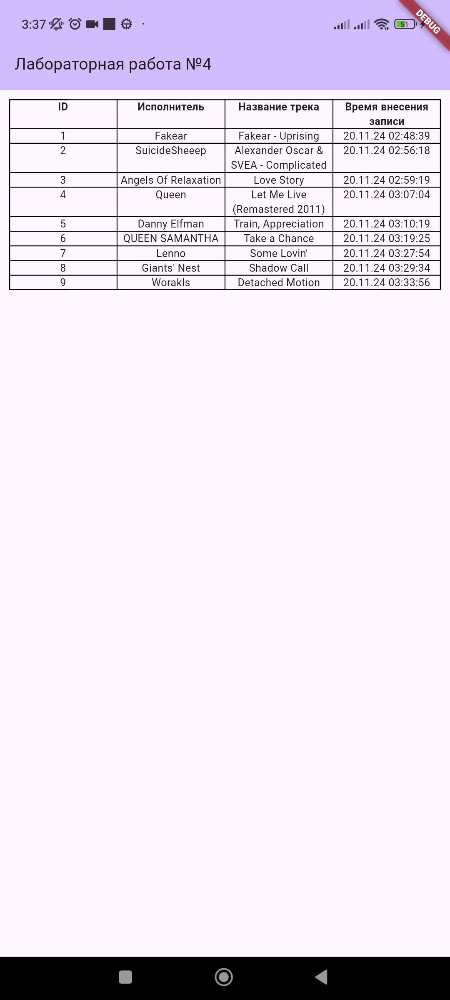
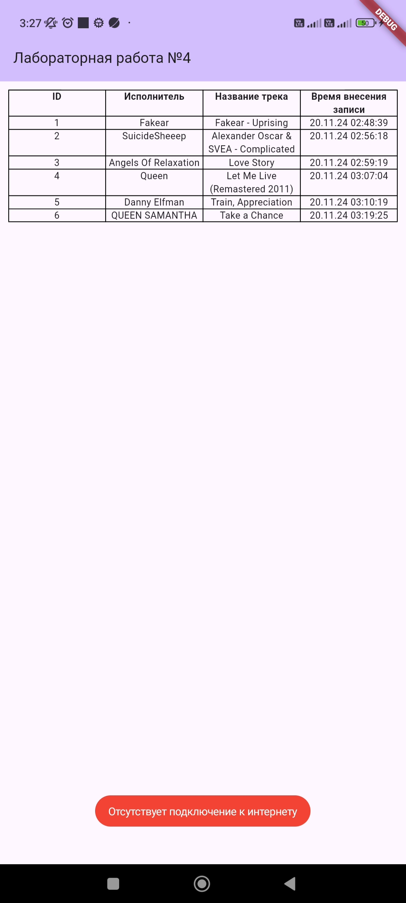

# Лабораторная работа №4. Взаимодействие с сервером.

Цель работы: Научиться работать с мультимедиа файлами. Изучить работу с классом AsyncTask

*Выполнила*: Иволгина Елизавета  
*Язык*: Dart

## Описание
Приложение состоит из одного экрана на котором отображается таблица с воспроизводимыми радиоканалом песнями, их авторами и временем, в которое они звучали.


<center></center>

\
При отсутствии интернета выводится `ToastMessage`, предупреждающее об этом пользователя.

<center></center>


## Как работает?
Приложение отслеживает текущую песню, играющую на веб-радио (EZIA), и сохраняет информацию о песнях в базе данных SQLite. Каждые 20 секунд приложение делает запрос к API для получения данных о песне, проверяет, изменилось ли название трека, и сохраняет новую запись в базе данных.

- При запуске проверяется наличие интернета с помощью `connectivity_plus`. Если подключение отсутствует, отображается тост с сообщением.
```
var result = await Connectivity().checkConnectivity();
if(result == ConnectivityResult.none) {
  Fluttertoast.showToast(
    msg: "Отсутствует подключение к интернету",
    toastLength: Toast.LENGTH_SHORT,
    gravity: ToastGravity.BOTTOM,
  );
}
```
- Каждые 20 секунд вызывается метод `fetchCurrentSong()`, который отправляет запрос на API для получения данных о текущей песне:
```
Future<void> fetchCurrentSong() async {
  final response = await http.get(Uri.parse('https://webradio.io/api/radio/ezia/current-song'));
  if (response.statusCode == 200) {
    final data = json.decode(response.body);
    await _addSong(data['artist'], data['title']);
  }
} 
```
Если запрос успешен, данные о песне передаются в функцию `_addSong`, которая проверяет, была ли уже добавлена такая песня. Если нет, она сохраняет новую песню в базе данных.

- Каждая полученная песня сохраняется в базе данных SQLite. Дублируемые песни в таблицу не вносятся.
```
Future<void> _addSong(String artist, String title) async {
  final existingSong = await _database.query('songs', where: 'title = ?', whereArgs: [title]);

  if (existingSong.isEmpty) {
    await _database.insert('songs', {'artist': artist, 'title': title, 'time': now});
    _loadSongs(); 
  }
}

```
- Вся информация о песнях отображается в таблице `songs`, которая обновляется каждый раз, когда добавляется новая запись в базу данных.
```
Table(
    for (var song in _songs)
      TableRow(
        children: [
          Text(song['id'].toString(), textAlign: TextAlign.center),
          ...
          Text(song['time'], textAlign: TextAlign.center),
        ],
      ),
  ],
)
```

****
### Как собрать   
* Установите Flutter SDK.
* Настройте Android studio: Установите плагины Flutter и Dart.
1. Загрузите репозиторий
2. Запустите Android Studio
3. Нажмите на "Open" и выберите папку с проектом
4. Выберите эмулятор(или подключите реальное устройство)
5. Нажмите "Run"